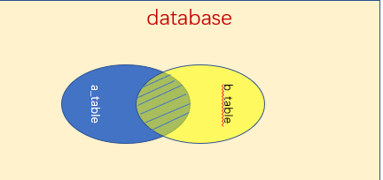
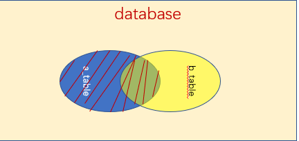
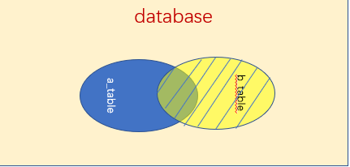

# 1 内连接

用法 ：`TABLE_A <[INNER JOIN|JOIN]> <TABLE_B> ON <连接条件>`

只有满足连接条件的行，才会被选中，取的是两个表中同时满足连接条件的行，是交集

# 2 左连接

用法：` TABLE_A <LEFT JOIN> <TABLE_B> ON <连接条件>`

以TABLE_A为基准，除了获取INNER JOIN的结果以外，对于TABLE_A中不满足连接条件的行，也会被加入结果集中，只是相应的字段为NULL

# 3 右连接

用法：` TABLE_A <RIGHT JOIN> <TABLE_B> ON <连接条件>`

以TABLE_B为基准，除了获取INNER JOIN的结果以外，对于TABLE_B中不满足连接条件的行，也会被加入结果集中，只是相应的字段为NULL

# 4 MySQL不支持全连接查询

MySQL的链接查询分为内连接，外连接，交叉连接，自然连接

自然连接会合并相同的行，不需要连接条件

内连接

外连接分为左外和右外

交叉连接是根据连接条件，组合得到的行，行数是笛卡尔乘积，条件使用WHERE 指定，不用ON