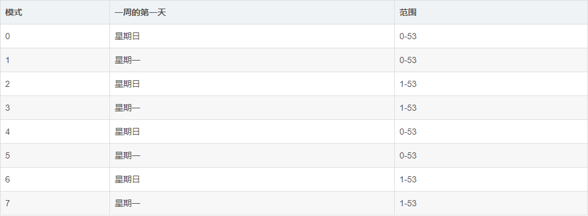
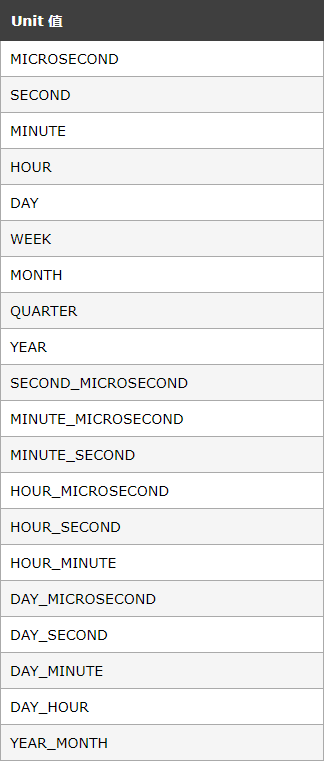

常见SQL语法函数使用

[TOC]

# 1 NULL相关

- 把字段设置为NULL，使用set xxx=NULL
- 判断字段是否为NULL，使用xxx IS NULL或IS NOT NULL

## 1.1 IFNULL

语法：`IFNULL(A,B)`,当A不是NULL时，返回A的值，否则返回B的值

## 1.2 ISNULL

语法：`ISNULL(A)`,当A是NULL时，返回1，返回0

## 1.3 NULLIF

语法：`NULLIF(A,B)`,当A=B时，返回NULL，否则返回A

# 2 IF函数

语法：`IF（exp1，exp2，exp3）`当exp1是true，返回exp2，否则返回exp3。

在版本8.0.19上的测试结果：当exp1是0，0.0，字符串，null时，exp1是否

# 3 有关时间的函数

## 3.1 WEEK

语法：`WEEK(DATE,MODE)`date是日期，mode是模式

该函数返回一个数字代表传入的日期在当年的第几周，mode是可选的，它指定了是把星期一当作一周的第一天还是把星期日当作一周的第一天；还有返回的周数的范围，规则下图所示：

mode的默认值在MySQL的环境变量中，可以通过` SHOW VARIABLES `查到，其名称是` default_week_format  `

## 3.2 EXTRACT

语法：`EXTRACT(UNIT FROM DATE)`

该函数可以抽取出来一个日期中的年，月，日等元素，unit取值参考下图：

# 4 有关字符串的函数

## 4.1 CONCAT

语法：`CONCAT(STR1,STR2,STR3......)`参数是可变的，返回把这些字符串连接起来的结果。

- 当其中有一个为NULL时，结果为NULL
- 里面数字时，会把数字转成其字符串形式

# 5 有关算术计算的函数

# 6 CAST函数

